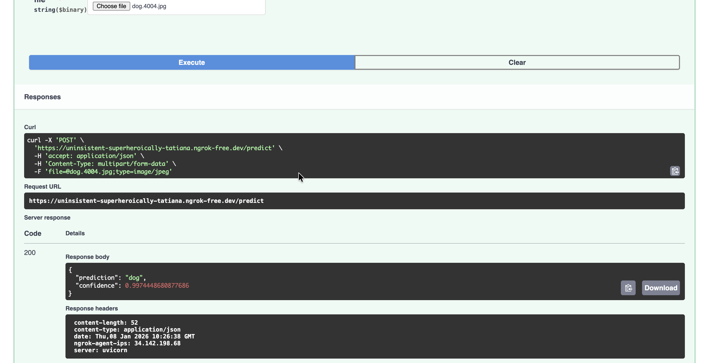

# AI-Based Image Classification Program

A simple image classification application that classifies cats vs dogs using deep learning.

## Demo

### Sample Results

*Example predictions showing cat and dog classifications with confidence scores*

### Video Demo
[](video.mov)
*Click to watch the classification demo*

## Requirements

```bash
pip install -r requirements.txt
```


## How to Run

### 1. Clone Repository
```bash
git clone https://github.com/yourusername/classification.git
cd classification
```

### 2. Install Dependencies
```bash
pip install -r requirements.txt
```


### 3. API 
```bash
# Run FastAPI server for model inference
uvicorn main:app --reload
```
- Access API at `http://localhost:8000`
- Interactive docs at `http://localhost:8000/docs`

## Project Structure
```
classification/
├── train_new.ipynb          # Main training notebook
├── main.py                 # FastAPI deployment script
├── requirements.txt        # Python dependencies
├── README.md               # Setup instructions
├── APPROACH.md             # Technical approach explanation
├── data.zip               # Dataset (cats and dogs images)
├── image.png              # Sample images and screenshots
├── video.mov              # Demo video
└── .gitignore             # Git ignore file
```

## Usage

### Training
1. Run notebook cells to train model
2. Model saves as `model.h5`

### API Prediction
```bash
curl -X POST "http://localhost:8000/predict/" \
     -H "accept: application/json" \
     -H "Content-Type: multipart/form-data" \
     -F "file=@your_image.jpg"
```


